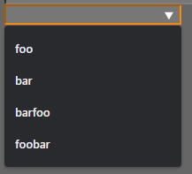

# Examples
- [Colors](#colors)
- [Text](#text)
- [Numbers](#numbers)
## Colors
### HTML
- `link` points to the location of the JSON. `rel=list` will use list.json to create a datalist using the JSON.
```html
<script src="https://cdn.jsdelivr.net/gh/legopitstop/Javascript/libs/list/list.js"></script>
<link rel="list" href="colors.json">
<input type="color" list="colorList">
```
### JSON
```json
{
    "$schema": "https://cdn.jsdelivr.net/gh/legopitstop/Javascript/libs/list/schema.json",
    "id": "colorList",
    "examples": [
        "#ff0000",
        "#00ff00",
        "#0000ff",
        "#00ffff",
        "#ffff00",
        "#ff00ff",
        "#ffffff",
        "#000000"
    ]
}
```
### RENDERED OUTPUT


[Back to top](#)

---

## Text
### HTML
```html
<script src="https://cdn.jsdelivr.net/gh/legopitstop/Javascript/libs/list/list.js"></script>
<link rel="list" href="text.json">
<input type="text" list="textList">
```
### JSON
```json
{
    "$schema": "https://cdn.jsdelivr.net/gh/legopitstop/Javascript/libs/list/schema.json",
    "id": "textList",
    "examples": [
        "foo",
        "bar",
        "barfoo",
        "foobar"
    ]
}
```
### RENDERED OUTPUT


[Back to top](#)

---

## Number
### HTML
```html
<script src="https://cdn.jsdelivr.net/gh/legopitstop/Javascript/libs/list/list.js"></script>
<link rel="list" href="number.json">
<input type="range" list="numList">
```
### JSON
```json
{
    "$schema": "https://cdn.jsdelivr.net/gh/legopitstop/Javascript/libs/list/schema.json",
    "id": "numList",
    "examples": [
        0,
        20,
        40,
        60,
        80,
        100
    ]
}
```
### RENDERED OUTPUT


[Back to top](#)

---